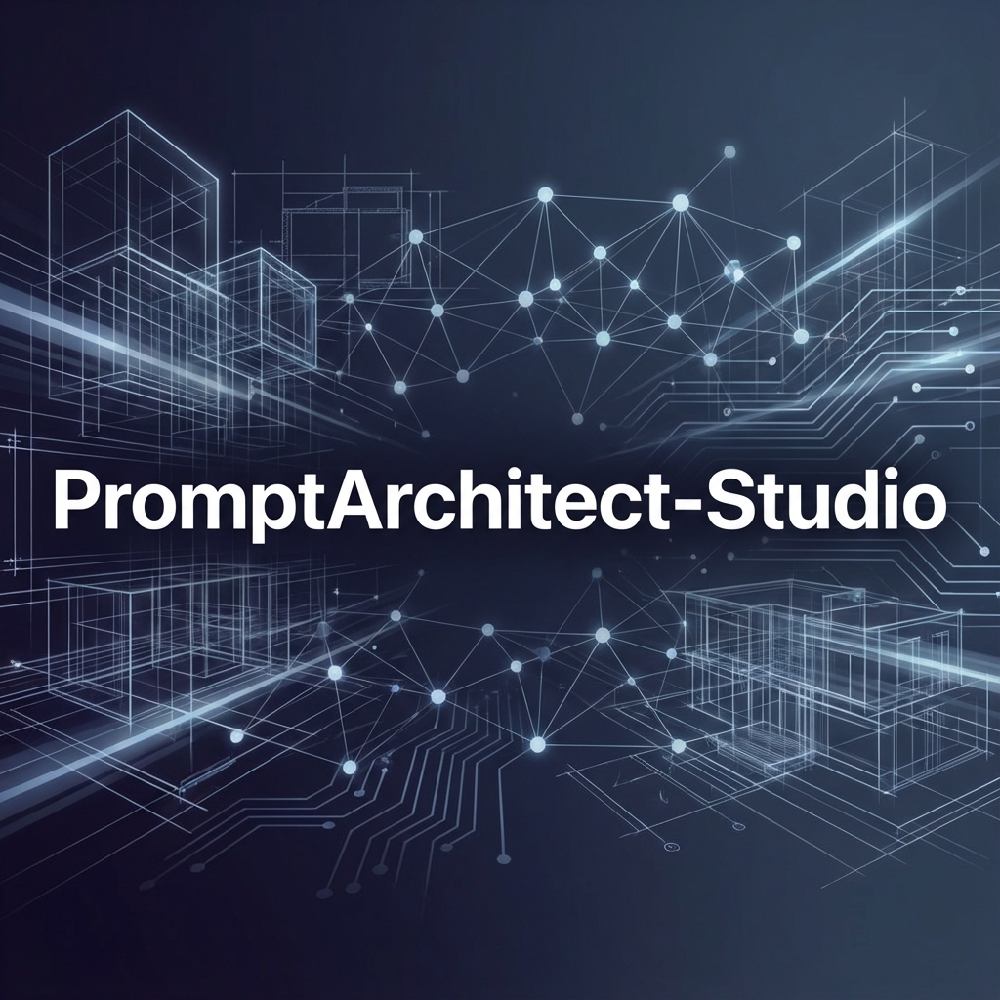

<div align="center">
  
  
  # 🏛️ PromptArchitect-Studio
  
  **Transform basic ideas into professional-grade AI prompts with structured engineering techniques.**
  
  [](#)
  [](https://vitejs.dev/)
  [](https://reactjs.org/)
  [](https://deepmind.google/technologies/gemini/)
</div>

---

## 🌟 Overview

PromptArchitect-Studio is a powerful web-based tool designed to elevate your interaction with Large Language Models (LLMs). By applying advanced prompt engineering techniques—such as persona assignment, strict constraint definition, and output formatting—this tool transforms simple user inputs into comprehensive, high-performing prompt frameworks.

### 🚀 Key Features

- **👤 Persona Engineering**: Automatically assigns expert roles and personas to your tasks.
- **🎯 Constraint Driven**: Defines clear boundaries to ensure focused and high-quality AI outputs.
- **📋 Structured Output Control**: Generates prompts that demand specific formats for easy integration.
- **⚡ Dual-Engine Support**: Choice between Google Gemini 3 Flash and self-hosted **Llama 3.2** via Ollama.
- **🕰️ History & Persistence**: Save and revisit your engineered architectures using Supabase integration.

## 📚 Documentation

- **[LLM Setup Guide](LLM_SETUP.md)**: Instructions for Gemini and self-hosted Ollama.
- **[Installation Guide](INSTALL.md)**: Setup instructions and environment configuration.
- **[Usage Guide](USAGE.md)**: How to use the application.
- **[Contributing Guide](CONTRIBUTING.md)**: Workflow and standards for developers.
- **[Agents & Tools](AGENTS.md)**: Information about the AI agents and tools used in this project.

## 🛠️ Tech Stack

PromptArchitect-Studio is built with modern, high-performance technologies:

- **Frontend**: [React 19](https://react.dev/) + [TypeScript](https://www.typescriptlang.org/)
- **Build Tool**: [Vite 6](https://vite.dev/)
- **Styling**: Vanilla CSS (Premium Aesthetics)
- **AI Engines**: [Google Gemini 3 Flash](https://ai.google.dev/) & [Ollama](https://ollama.com/) (Llama 3.2)
- **Backend/DB**: [Supabase](https://supabase.com/)
- **Git Hooks**: [Husky](https://typicode.github.io/husky/) + [SecretLint](https://github.com/secretlint/secretlint)

## 🚦 Getting Started

### Prerequisites

- [Node.js](https://nodejs.org/) (v18 or higher)
- A Gemini API Key
- Supabase account and project

### Local Installation

1.  **Clone and Install**:

    ```bash
    git clone https://github.com/sf-bcca/PromptArchitect-Studio.git
    cd PromptArchitect-Studio
    npm install
    ```

2.  **Configure**:
    Create a `.env.local` file in the root directory and add your credentials:

    ```env
    VITE_SUPABASE_URL=your_supabase_url
    VITE_SUPABASE_ANON_KEY=your_supabase_anon_key
    ```

3.  **Launch the development server:**
    ```bash
    npm run dev
    ```

## 🌐 Deployment

<div align="center">
  <p>Developed with ❤️ by Expert Prompt Engineers</p>
</div>
