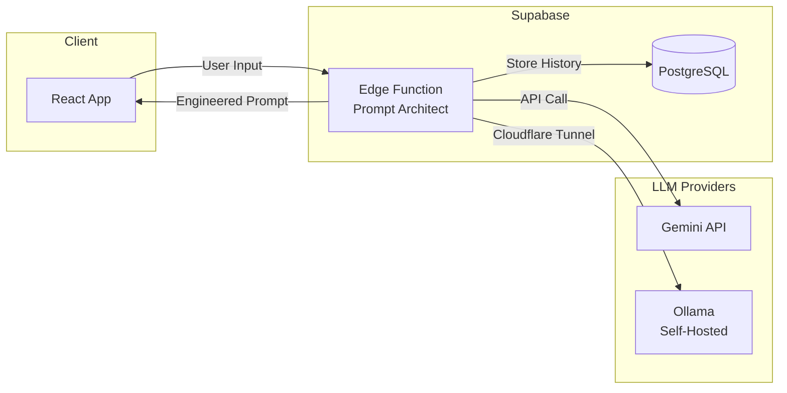

<div align="center">
  
  
  # 🏛️ PromptArchitect-Studio
  
  **Transform basic ideas into professional-grade AI prompts with structured engineering techniques.**
  
  [](#)
  [](https://vitejs.dev/)
  [](https://reactjs.org/)
  [](https://deepmind.google/technologies/gemini/)
</div>

---

> ⏱️ **Get started in under 5 minutes** — Clone, configure, and engineer your first prompt.

## 🌟 Overview

PromptArchitect-Studio is a powerful web-based tool designed to elevate your interaction with Large Language Models (LLMs). By applying advanced prompt engineering techniques—such as persona assignment, strict constraint definition, and output formatting—this tool transforms simple user inputs into comprehensive, high-performing prompt frameworks.

### 🚀 Key Features

- **👤 Persona Engineering**: Automatically assigns expert roles and personas to your tasks.
- **🎯 Constraint Driven**: Defines clear boundaries to ensure focused and high-quality AI outputs.
- **📋 Structured Output Control**: Generates prompts that demand specific formats for easy integration.
- **⚡ Dual-Engine Support**: Choice between Google Gemini 3 Flash and self-hosted **Llama 3.2** via Ollama.
- **🕰️ History & Persistence**: Save and revisit your engineered architectures using Supabase integration.

## 🏗️ Architecture



## 🚦 Quick Start

### Prerequisites

- [Node.js](https://nodejs.org/) v18+ and [pnpm](https://pnpm.io/)
- A [Supabase](https://supabase.com/) account and project
- A [Gemini API Key](https://aistudio.google.com/) (for cloud LLM)

### Installation

```bash
# Clone the repository
git clone https://github.com/sf-bcca/PromptArchitect-Studio.git
cd PromptArchitect-Studio

# Install dependencies
pnpm install

# Configure environment
cp .env.example .env.local
# Edit .env.local with your Supabase credentials

# Start development server
pnpm dev
```

Open [http://localhost:5173](http://localhost:5173) — you're ready to engineer prompts!

## 📚 Documentation

| Guide                                 | Description                                    |
| ------------------------------------- | ---------------------------------------------- |
| [Installation Guide](INSTALL.md)      | Detailed setup and environment configuration   |
| [LLM Setup Guide](LLM_SETUP.md)       | Configure Gemini or self-hosted Ollama         |
| [Usage Guide](USAGE.md)               | How to use the application effectively         |
| [Deployment Guide](DEPLOY.md)         | Docker deployment for production               |
| [Contributing Guide](CONTRIBUTING.md) | Workflow and standards for developers          |
| [Agents & Tools](AGENTS.md)           | AI agents and MCP servers used in this project |

## 🛠️ Tech Stack

| Layer          | Technology                                                                                          |
| -------------- | --------------------------------------------------------------------------------------------------- |
| **Frontend**   | [React 19](https://react.dev/) + [TypeScript](https://www.typescriptlang.org/)                      |
| **Build Tool** | [Vite 6](https://vite.dev/)                                                                         |
| **Styling**    | Vanilla CSS (Premium Aesthetics)                                                                    |
| **AI Engines** | [Google Gemini 3 Flash](https://ai.google.dev/) & [Ollama](https://ollama.com/) (Llama 3.2)         |
| **Backend/DB** | [Supabase](https://supabase.com/)                                                                   |
| **Testing**    | [Vitest](https://vitest.dev/) + [Playwright](https://playwright.dev/)                               |
| **Git Hooks**  | [Husky](https://typicode.github.io/husky/) + [SecretLint](https://github.com/secretlint/secretlint) |

## 🌐 Deployment

### Automated CI/CD Pipeline

Pushing to `main` triggers a fully automated deployment:

1. **Tests Run** — PR validation and E2E tests verify your changes
2. **Docker Build** — Image builds and pushes to [GitHub Container Registry](https://ghcr.io)
3. **Auto-Deploy** — Server pulls and restarts the container via Tailscale

### Manual Deployment

For manual or first-time deployment, see [DEPLOY.md](DEPLOY.md) for Docker Compose instructions.

## 🆘 Need Help?

- **Common Issues**: Check the [Troubleshooting](DEPLOY.md#5-troubleshooting) section
- **LLM Errors**: See [LLM Setup Guide](LLM_SETUP.md) for provider configuration
- **Bug Reports**: Open an [issue on GitHub](https://github.com/sf-bcca/PromptArchitect-Studio/issues)

---

<div align="center">
  <p>Developed with ❤️ by Expert Prompt Engineers</p>
</div>
